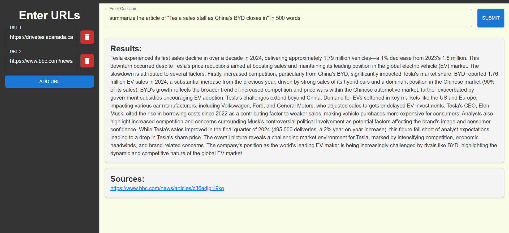

# Rag-QuerySystem

This project implements a Retrieval-Augmented Generation (RAG) query system using LangChain and various tools to provide intelligent answers from user-provided URLs. It features a backend built with FastAPI and a frontend powered by React and Material-UI.

---

## Getting Started

Follow the steps below to clone the repository, install dependencies, and start both the backend and frontend servers.


### Prerequisites

- **Python** 3.8 or higher  
- **Node.js** 16 or higher  
- **npm** (comes with Node.js)  
- **Git**  

---

## Clone the Repository

```bash
# Clone the repository to your local machine
git clone https://github.com/buttaRahul/Rag-QuerySystem.git

# Navigate to the project directory
cd Rag-QuerySystem
```
---

## Backend Setup
### Install Dependencies

```bash
# Navigate to the backend directory
cd backend

# Create a virtual environment
python -m venv venv

# Activate the virtual environment
# On Windows:
venv\Scripts\activate
# On macOS/Linux:
source venv/bin/activate

# Install Python dependencies
pip install -r requirements.txt
```


### Start the Backend Server
Once dependencies are installed, start the backend server:

```bash
# Run the FastAPI backend server
uvicorn main:app --reload

# The server will run at http://127.0.0.1:8000
```
---

## Frontend Setup
### Install Dependencies
Navigate to the frontend directory and install the required JavaScript dependencies:

```bash
# Navigate to the frontend directory
cd ../frontend

# Install npm packages
npm install
```

### Start the Frontend Server

```bash
# Start the React frontend server
npm run dev

# The frontend server will run at http://localhost:3000
```
---

## Accessing the Application
Once both the backend and frontend servers are running:
- Open your browser and navigate to http://localhost:3000 to interact with the application.
- The backend API can be accessed at http://127.0.0.1:8000.

---

## Project Structure
- backend/: Contains the FastAPI backend code.
- frontend/: Contains the React frontend code.
- requirements.txt: Lists Python dependencies for the backend.
- package.json: Lists JavaScript dependencies for the frontend.

## Project Demonstration
click the image to watch video demonstration
[](https://drive.google.com/file/d/1xySCE7QLMmfa02cXi1XwyFTyD0-fqBgY/view?usp=sharing)


